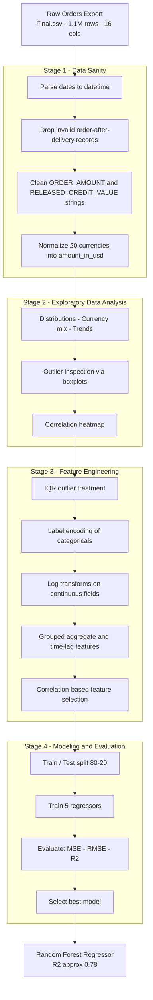

# Order Amount Prediction

An end-to-end machine learning pipeline that predicts the monetary value of customer orders (in USD) from raw, multi-currency SAP-style order data — spanning data sanitization, exploratory analysis, feature engineering, and comparative model evaluation on a dataset of over one million records.

<p align="left">
  
  
  
  
  
  
</p>

---

## Overview

This project addresses a **supervised regression** problem: given the attributes of a sales order — customer, currency, distribution channel, order and delivery dates, credit information, and more — predict the final **order amount in USD**.

The solution is structured as a four-stage pipeline that mirrors a production-oriented ML workflow, taking raw, inconsistent transactional data and progressively shaping it into a clean, feature-rich dataset ready for modeling.

> The target variable, `amount_in_usd`, is derived by normalizing twenty different order currencies into a single USD denomination, then log-transformed to stabilize variance before training.

---

## Architecture

The end-to-end flow, from raw export to a selected model, is shown below.



> If the diagram above does not render, view this README on GitHub, which supports Mermaid natively. A plain-text fallback is provided in the [Pipeline Stages](#pipeline-stages) section.

---

## Dataset

The pipeline operates on a raw orders export (`Final.csv`), which is **not included in this repository**.

| Property | Value |
|----------|-------|
| Records | 1,101,925 |
| Raw columns | 16 |
| Currencies | 20 (normalized to USD) |
| Target variable | `amount_in_usd` |
| Problem type | Regression |

Core raw fields:

```
ORDER_CREATION_DATE    REQUESTED_DELIVERY_DATE   ORDER_AMOUNT
ORDER_CURRENCY         CUSTOMER_NUMBER           COMPANY_CODE
SALES_ORG              DISTRIBUTION_CHANNEL      DIVISION
PURCHASE_ORDER_TYPE    CREDIT_CONTROL_AREA       SOLD_TO_PARTY
RELEASED_CREDIT_VALUE  CREDIT_STATUS             CUSTOMER_ORDER_ID
```

> To reproduce the notebook end-to-end, supply your own `Final.csv` containing the columns listed above.

---

## Pipeline Stages

### Stage 1 - Data Sanity

Establishes a trustworthy baseline from raw, inconsistent input.

- Parsed `ORDER_CREATION_DATE` and `REQUESTED_DELIVERY_DATE` into `datetime` (`%Y%m%d`).
- Removed **27,142** logically invalid records where the order date followed the delivery date.
- Cleaned malformed numeric strings in `ORDER_AMOUNT` and `RELEASED_CREDIT_VALUE` (removed `-`, converted `,` to `.`, cast to `float`).
- Built `amount_in_usd` by converting all twenty currencies through a fixed exchange-rate map.
- Created a composite `unique_cust_id` from `CUSTOMER_NUMBER` and `COMPANY_CODE`.

### Stage 2 - Exploratory Data Analysis

Surfaces distributional structure and data-quality concerns.

- Distribution of orders across channels (full and top-30 views).
- Currency mix as a proportion of total volume (USD and EUR dominate).
- Order-amount trends over time and against purchase-order type.
- Boxplots to expose outliers, per-currency and in normalized USD.
- A correlation heatmap to guide later feature selection.

### Stage 3 - Feature Engineering and Selection

Transforms cleaned data into a model-ready feature matrix.

- **Outlier treatment** — detected **98,216** outliers in `amount_in_usd` via the IQR rule and replaced them with the column median.
- **Encoding** — label-encoded all categorical fields.
- **Transformation** — applied `log1p` to continuous fields to reduce skew.
- **Derived features** — group-level aggregates (mean amount per division, max per channel, totals per division-channel) and per-customer time-lag features (trailing five-day sales and day-over-day differences).
- **Selection** — retained predictors above a correlation threshold with the target.

### Stage 4 - Modeling and Evaluation

Trains and compares five regressors on an 80/20 split, scored on MSE, RMSE, and R-squared.

> Support Vector Machine was deliberately excluded: pairwise distance computation over one million-plus rows is prohibitively expensive. Hyperparameter tuning via `RandomizedSearchCV` was scoped out for the same reason; the implementation is retained, commented out, as documented future work.

---

## Results

| Model | RMSE | R2 Score | Rank |
|-------|:----:|:--------:|:----:|
| Linear Regression | 2.409 | 0.125 | 5 |
| AdaBoost | 2.222 | 0.256 | 4 |
| Decision Tree | 1.658 | 0.586 | 3 |
| XGBoost | 1.333 | 0.732 | 2 |
| **Random Forest** | **1.202** | **0.782** | **1** |

> The **Random Forest Regressor** achieves the strongest performance with **R-squared approximately 0.78**, narrowly ahead of XGBoost. Both ensemble methods substantially outperform the linear and boosting-stump baselines, reflecting the non-linear interactions present in the data.

---

## Getting Started

### Prerequisites

```bash
pip install pandas numpy seaborn matplotlib scikit-learn xgboost
```

### Run

```bash
git clone https://github.com/pratim4dasude/Order-Amount-prediction.git
cd Order-Amount-prediction

# Place your dataset as Final.csv in this directory, then launch:
jupyter notebook "Order amount prediction.ipynb"
```

Execute the cells sequentially; each stage depends on the output of the previous one.

---

## Project Structure

```
Order-Amount-prediction/
|-- Order amount prediction.ipynb   # Full pipeline: cleaning, EDA, feature engineering, modeling
|-- README.md
```

---

## Tech Stack

| Category | Tools |
|----------|-------|
| Language | Python 3.x |
| Environment | Jupyter Notebook |
| Data | Pandas, NumPy |
| Visualization | Seaborn, Matplotlib |
| Modeling | scikit-learn, XGBoost |

